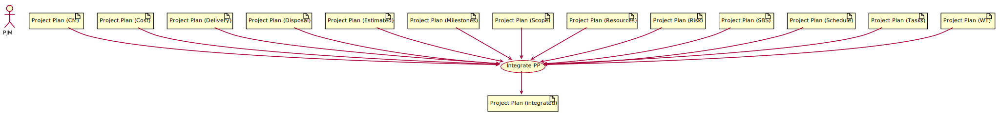

# ISO 29910-5-6-2 PM Activities

## PM.1: Planning

### PM.1.1: Review SoW

* Inputs:
   * [SoW](iso29110-5-6-2-ProcessProducts.md#statement-of-work-sow)
* Outputs:
   * [SoW](iso29110-5-6-2-ProcessProducts.md#statement-of-work-sow)

### PM.1.2: Define Delivery Instructions

* Inputs:
   * [SoW](iso29110-5-6-2-ProcessProducts.md#statement-of-work-sow)
* Outputs:
   * [Project Plan](iso29110-5-6-2-ProcessProducts.md#project-plan): Delivery Instructions

### PM.1.3: Define SBS

* Inputs:
   * [SDD](iso29110-5-6-2-ProcessProducts.md#system-design-document-sdd)
* Outputs:
   * [Project Plan](iso29110-5-6-2-ProcessProducts.md#project-plan): SBS

### PM.1.4: Define Milestones

* Inputs:
   * [SoW](iso29110-5-6-2-ProcessProducts.md#statement-of-work-sow)
   * [Project Plan](iso29110-5-6-2-ProcessProducts.md#project-plan): SBS
* Outputs:
   * [Project Plan](iso29110-5-6-2-ProcessProducts.md#project-plan): Milestones

### PM.1.5: Define Tasks

* Inputs:
   * [SoW](iso29110-5-6-2-ProcessProducts.md#statement-of-work-sow)
   * [Project Plan](iso29110-5-6-2-ProcessProducts.md#project-plan): SBS
* Outputs:
   * [Project Plan](iso29110-5-6-2-ProcessProducts.md#project-plan): Tasks

### PM.1.6: Estimate

* Inputs:
   * [Project Plan](iso29110-5-6-2-ProcessProducts.md#project-plan): Tasks
* Outputs:
   * [Project Plan](iso29110-5-6-2-ProcessProducts.md#project-plan): Estimated

### PM.1.7: Identify Resources

* Inputs:
   * [SoW](iso29110-5-6-2-ProcessProducts.md#statement-of-work-sow)
* Outputs:
   * [Project Plan](iso29110-5-6-2-ProcessProducts.md#project-plan): Resources

### PM.1.8: Define WT

* Inputs:
   * [Project Plan](iso29110-5-6-2-ProcessProducts.md#project-plan): Resources
* Outputs:
   * [Project Plan](iso29110-5-6-2-ProcessProducts.md#project-plan): WT

### PM.1.9: Schedule Tasks

* Inputs:
   * [Project Plan](iso29110-5-6-2-ProcessProducts.md#project-plan): Estimated
   * [Project Plan](iso29110-5-6-2-ProcessProducts.md#project-plan): Tasks
   * [Project Plan](iso29110-5-6-2-ProcessProducts.md#project-plan): WT
* Outputs:
   * [Project Plan](iso29110-5-6-2-ProcessProducts.md#project-plan): Schedule

### PM.1.10: Estimate Cost

* Inputs:
   * [Project Plan](iso29110-5-6-2-ProcessProducts.md#project-plan): Resources
   * [Project Plan](iso29110-5-6-2-ProcessProducts.md#project-plan): Schedule
* Outputs:
   * [Project Plan](iso29110-5-6-2-ProcessProducts.md#project-plan): Cost

### PM.1.11: Identify Risk Management

* Inputs:
   * [Project Plan](iso29110-5-6-2-ProcessProducts.md#project-plan): WT
   * [Project Plan](iso29110-5-6-2-ProcessProducts.md#project-plan): Tasks
   * [Project Plan](iso29110-5-6-2-ProcessProducts.md#project-plan): Schedule
   * [Project Plan](iso29110-5-6-2-ProcessProducts.md#project-plan): SBS
   * [Project Plan](iso29110-5-6-2-ProcessProducts.md#project-plan): Risk
   * [Project Plan](iso29110-5-6-2-ProcessProducts.md#project-plan): Resources
   * [Project Plan](iso29110-5-6-2-ProcessProducts.md#project-plan): Milestones
   * [Project Plan](iso29110-5-6-2-ProcessProducts.md#project-plan): Delivery
   * [Project Plan](iso29110-5-6-2-ProcessProducts.md#project-plan): Cost
* Outputs:
   * [Project Plan](iso29110-5-6-2-ProcessProducts.md#project-plan): Risk

### PM.1.12: Identify Disposal Approach

* Inputs:
   * [SoW](iso29110-5-6-2-ProcessProducts.md#sow): SoW
* Outputs:
   * [Project Plan](iso29110-5-6-2-ProcessProducts.md#project-plan): Disposal

### PM.1.13: Identify CM Strategy

* Inputs:
   * [Project Plan](iso29110-5-6-2-ProcessProducts.md#project-plan): SBS
* Outputs:
   * [Project Plan](iso29110-5-6-2-ProcessProducts.md#project-plan): CM

### PM.1.14: Define Scope

* Inputs:
   * [SoW](iso29110-5-6-2-ProcessProducts.md#sow): SoW
* Outputs:
   * [Project Plan](iso29110-5-6-2-ProcessProducts.md#project-plan): Scope

### PM.1.15: Integrate PP

* Inputs:
   * [Project Plan](iso29110-5-6-2-ProcessProducts.md#project-plan): WT
   * [Project Plan](iso29110-5-6-2-ProcessProducts.md#project-plan): Tasks
   * [Project Plan](iso29110-5-6-2-ProcessProducts.md#project-plan): Schedule
   * [Project Plan](iso29110-5-6-2-ProcessProducts.md#project-plan): SBS
   * [Project Plan](iso29110-5-6-2-ProcessProducts.md#project-plan): Risk
   * [Project Plan](iso29110-5-6-2-ProcessProducts.md#project-plan): Resources
   * [Project Plan](iso29110-5-6-2-ProcessProducts.md#project-plan): Milestones
   * [Project Plan](iso29110-5-6-2-ProcessProducts.md#project-plan): Delivery
   * [Project Plan](iso29110-5-6-2-ProcessProducts.md#project-plan): Cost
   * [Project Plan](iso29110-5-6-2-ProcessProducts.md#project-plan): Risk
   * [Project Plan](iso29110-5-6-2-ProcessProducts.md#project-plan): Disposal
   * [Project Plan](iso29110-5-6-2-ProcessProducts.md#project-plan): CM
   * [Project Plan](iso29110-5-6-2-ProcessProducts.md#project-plan): Scope
* Outputs:
   * [Project Plan](iso29110-5-6-2-ProcessProducts.md#project-plan)

### PM.1.16: Verify PP

* Inputs:
   * [Project Plan](iso29110-5-6-2-ProcessProducts.md#project-plan)
* Outputs:
   * [Project Plan](iso29110-5-6-2-ProcessProducts.md#project-plan)

### PM.1.17: PP Acceptance

* Inputs:
   * [Project Plan](iso29110-5-6-2-ProcessProducts.md#project-plan)
   * [SoW](iso29110-5-6-2-ProcessProducts.md#sow)
* Outputs:
   * [Project Plan](iso29110-5-6-2-ProcessProducts.md#project-plan)

### PM.1.18: Establish Project Repository

* Inputs:
   * [Project Plan](iso29110-5-6-2-ProcessProducts.md#project-plan): CM
* Outputs:
   * [Project Repository](iso29110-5-6-2-ProcessProducts.md#project-repository)

### PM.1.19: Assign Tasks

* Inputs:
   * [Project Plan](iso29110-5-6-2-ProcessProducts.md#project-plan)
* Outputs:
   * [Project Plan](iso29110-5-6-2-ProcessProducts.md#project-plan)

## PM.2: Execution

### PM.2.1: Monitor Progress

### PM.2.2: Evaluate CRs

### PM.2.3: Conduct WT Meetings

### PM.2.4: Conduct STK Meetings

### PM.2.5: Configuration Management

### PM.2.6: Repository Management

### PM.2.7: Recover Repository

## PM.3: Control

* Inputs:
   * [SDD](iso29110-5-6-2-ProcessProducts.md#system-design-document-sdd)
   * [Traceability Matrix](iso29110-5-6-2-ProcessProducts.md#system-design-document-sdd)
   * [Project Plan](iso29110-5-6-2-ProcessProducts.md#project-plan)
* Updates:
   * [Progress Status Record](iso29110-5-6-2-ProcessProducts.md#progress-status-record)
* Outputs:
   * [Justification Document](iso29110-5-6-2-ProcessProducts.md#justification-document)
   * [Corrections Register](iso29110-5-6-2-ProcessProducts.md#corrections-register)

### PM.3.1: Evaluate Progress

### PM.3.2: Address Risk

### PM.3.3: Justify

## PM.4: Closure

### PM.4.1: Formalize Completion

### PM.4.2: Update Repository

### PM.4.3: Dispose

