# ISO 29910-5-6-2 Process Products

## Process Documents

### Statement of Work (SOW)

Statement of Work (SOW)

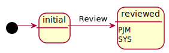

- [PM.1.1: Review SoW](iso29110-5-6-2-PM.md#pm11-review-sow)

### Project Plan

Project Plan

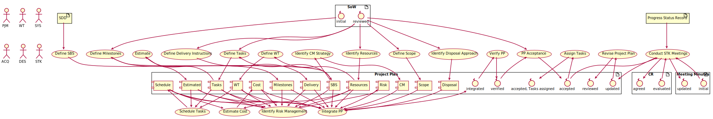

- [PM.1.2: Define Delivery Instructions](iso29110-5-6-2-PM.md#pm12-define-delivery-instructions)
- [PM.1.3: Define SBS](iso29110-5-6-2-PM.md#pm13-define-sbs)
- [PM.1.4: Define Milestones](iso29110-5-6-2-PM.md#pm14-define-milestones)
- [PM.1.5: Define Tasks](iso29110-5-6-2-PM.md#pm15-define-tasks)
- [PM.1.6: Estimate](iso29110-5-6-2-PM.md#pm16-estimaet)
- [PM.1.7: Identify Resources](iso29110-5-6-2-PM.md#pm17-identify-resources)
- [PM.1.8: Define WT](iso29110-5-6-2-PM.md#pm18-define-wt)
- [PM.1.9: Schedule Tasks](iso29110-5-6-2-PM.md#pm19-schedule-tasks)
- [PM.1.10: Estimate Cost](iso29110-5-6-2-PM.md#pm110-estimate-costs)
- [PM.1.11: Identify Risk Management](iso29110-5-6-2-PM.md#pm111-identify-risk-management)
- [PM.1.12: Identify Disposal Approach](iso29110-5-6-2-PM.md#pm112-identify-disposal-approach)
- [PM.1.13: Identify CM Strategy](iso29110-5-6-2-PM.md#pm113-identify-cm-strategy)
- [PM.1.14: Define Scope](iso29110-5-6-2-PM.md#pm114-define-scope)
- [PM.1.15: Integrate PP](iso29110-5-6-2-PM.md#pm115-integrate-pp)
- [PM.1.16: Verify PP](iso29110-5-6-2-PM.md#pm116-verify-pp)
- [PM.1.17: PP Acceptance](iso29110-5-6-2-PM.md#pm117-pp-acceptance)
- [PM.1.19: Assign Tasks](iso29110-5-6-2-PM.md#pm119-assign-tasks)
- [PM.2.4: Conduct STK Meetings](iso29110-5-6-2-PM.md#pm24-conduct-stk-meetings)
- [SR.1.1: Revise Project Plan](iso29110-5-6-2-SR.md#sr11-revise-project-plan)

### Data Model

Data Model

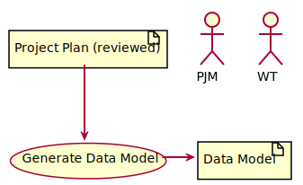

- [SR.1.3: Generate Data Model](iso29110-5-6-2-SR.md#sr13-generate-data-model)

### Stakeholders Requirement Specifications (StRS)

Stakeholders Requirement Specifications (StRS)

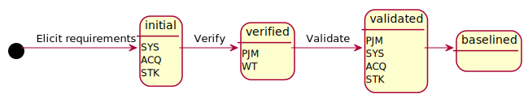

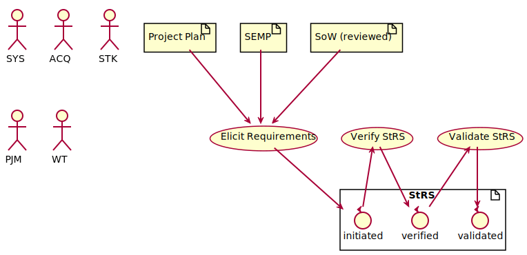

- [SR.2.1: Elicit Requirements](iso29110-5-6-2-SR.md#sr21-elicit-requirements)
- [SR.2.2: Verify StRS](iso29110-5-6-2-SR.md#sr22-verify-strs)
- [SR.2.3: Validate StRS](iso29110-5-6-2-SR.md#sr23-validate-strs)

### System Design Document (SDD)

System Design Document (SDD)

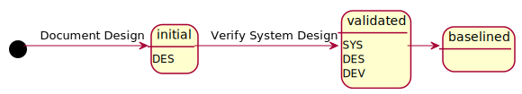

- [SR.3.1: Functional Design](iso29110-5-6-2-SR.md#sr31-functional-design)
- [SR.3.3: Physical Design](iso29110-5-6-2-SR.md#sr33-physical-design)
- [SR.3.5: Verify System Design](iso29110-5-6-2-SR.md#sr35-verify-system-design)

### Systems Engineering Management Plan (SEMP)

Systems Engineering Management Plan (SEMP)

- [SR.1.2: Generate SEMP](iso29110-5-6-2-SR.md#sr12-generate-semp)

### System Requirements Specifications (SysRS)

System Requirements Specifications (SysRS)

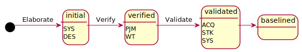

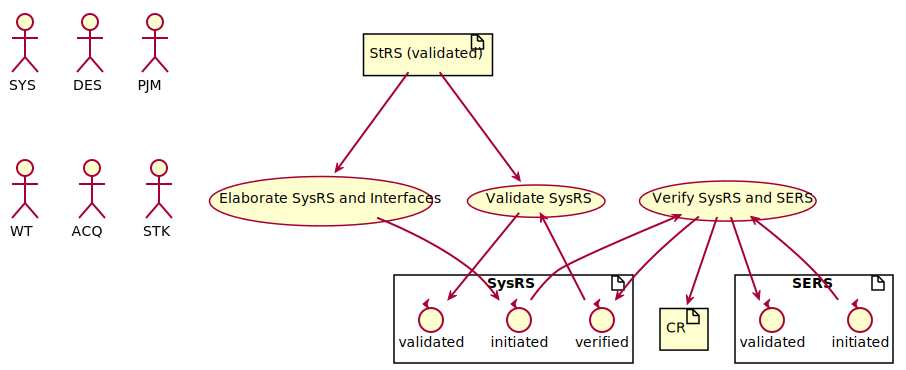

- [SR.2.4: Elaborate SysRS and Interfaces](iso29110-5-6-2-SR.md#sr24-elaborate-sysrs-and-interfaces)
- [SR.2.6: Verify SysRS and SERS](iso29110-5-6-2-SR.md#sr26-verify-sysrs-and-sers)
- [SR.2.7: Validate SysRS](iso29110-5-6-2-SR.md#sr27-validate-sysrs)

### System Elements Requirements Specifications (SERS)

System Element Requirements Specifications (SERS)

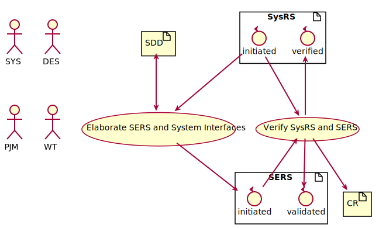

- [SR.2.5: Elaborate SERS and System Interfaces](iso29110-5-6-2-SR.md#sr25-elaborate-sers-and-system-interfaces)
- [SR.2.6: Verify SysRS and SERS](iso29110-5-6-2-SR.md#sr26-verify-sysrs-and-sers)

### Change Request

Change Request

### IVV Plan

IVV Plan

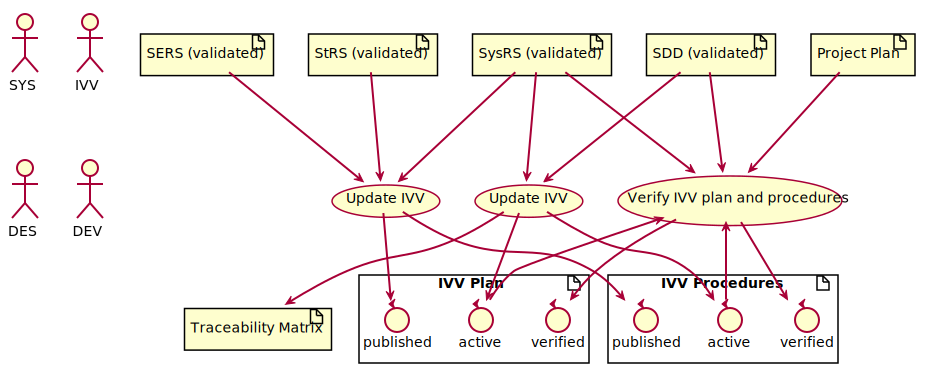

- [SR.2.9: Update IVV](iso29110-5-6-2-SR.md#sr29-update-ivv)
- [SR.3.6: Update IVV](iso29110-5-6-2-SR.md#sr36-update-ivv)
- [SR.5.1: Verify IVV plan and procedures](iso29110-5-6-2-SR.md#sr51-verify-ivv-plan-and-procedures)

### IVV Procedures

IVV Procedures

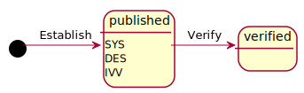

- [SR.2.9: Update IVV](iso29110-5-6-2-SR.md#sr29-update-ivv)
- [SR.3.6: Update IVV](iso29110-5-6-2-SR.md#sr36-update-ivv)
- [SR.5.1: Verify IVV plan and procedures](iso29110-5-6-2-SR.md#sr51-verify-ivv-plan-and-procedures)

### Product Acceptance Record

Product Acceptance Record

- [SR.5.4: Validate System](iso29110-5-6-2-SR.md#sr54-validate-system)
- [SR.6.1: Review Product](iso29110-5-6-2-SR.md#sr61-review-product)
- [SR.6.4: V&V Maintenance and Training](iso29110-5-6-2-SR.md#sr64-vv-maintenance-and-training)
- [PM.4.1: Formalize Completion](iso29110-5-6-2-PM.md#pm41-formalize-completion)
- [SR.6.6: Transition to Manufacturing and support](iso29110-5-6-2-SR.md#sr66-transition-to-manufacturing-and-support)

### Purchase Order

Purchase Order

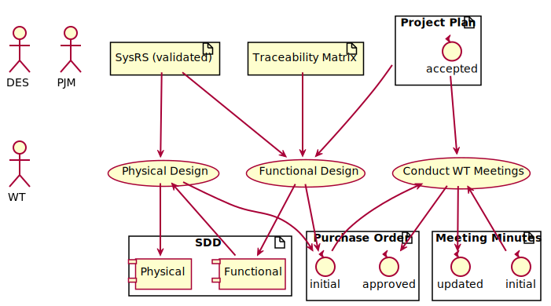

- [SR.3.1: Functional Design](iso29110-5-6-2-SR.md#sr31-functional-design)
- [SR.3.3: Physical Design](iso29110-5-6-2-SR.md#sr33-physical-design)
- [PM.2.3: Conduct WT Meetings](iso29110-5-6-2-PM.md#pm23-conduct-wt-meetings)

### Traceability Matrix

Traceability Matrix

### System User Manual

System User Manual

- [SR.3.7: Create System Manual](iso29110-5-6-2-SR.md#sr37-create-system-manual)
- [SR.3.8: Verify System Manual](iso29110-5-6-2-SR.md#sr38-verify-system-manual)

### System Operation Guide

System Operation Guide

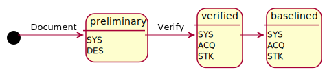

- [SR.5.6: Document Operation Guide](iso29110-5-6-2-SR.md#sr56-document-operation-guide)
- [SR.5.7: Verify Operation Guide](iso29110-5-6-2-SR.md#sr57-verify-operation-guide)

### System Maintenance Document

System Maintenance Document

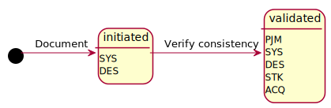

- [SR.6.2: Document Maintenance Manual](iso29110-5-6-2-SR.md#sr62-document-maintenance-manual)
- [SR.6.4: V&V Maintenance and Training](iso29110-5-6-2-SR.md#sr64-vv-maintenance-and-training)

### System Training Specifications

System Training Specifications

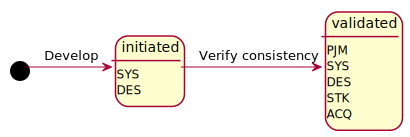

- [SR.6.3: Document Training Spec](iso29110-5-6-2-SR.md#sr63-document-training-spec)
- [SR.6.4: V&V Maintenance and Training](iso29110-5-6-2-SR.md#sr64-vv-maintenance-and-training)

## Process Reports

### Correction Register

Correction Register

### Integration Report

Integration Report

### Justification Document

Justification Document

### Meeting Record

Meeting Record

### Progress Status Record

Progress Status Record

### Validation Report

Validation Report

### Verification Report

Verification Report

## Process Meta Elements

### System

System: Defined by Stakeholders Requirements Document

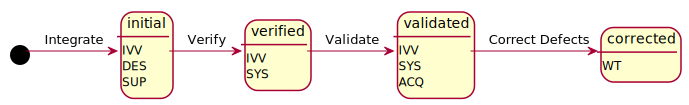

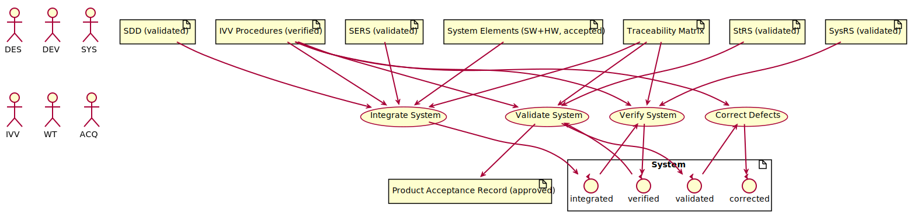

- [SR.5.2: Integrate System](iso29110-5-6-2-SR.md#sr52-integrate-system)
- [SR.5.3: Verify System](iso29110-5-6-2-SR.md#sr53-verify-system)
- [SR.5.4: Validate System](iso29110-5-6-2-SR.md#sr54-validate-system)
- [SR.5.5: Correct Defects](iso29110-5-6-2-SR.md#sr55-correct-defects)

### Product

Product: defined in Project Plan

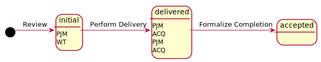

- [SR.6.1: Review Product](iso29110-5-6-2-SR.md#sr61-review-product)
- [SR.6.5: Perform Delivery](iso29110-5-6-2-SR.md#sr65-perform-delivery)
- [PM.4.1: Formalize Completion](iso29110-5-6-2-PM.md#pm41-formalize-completion)

### Project Repository

Project Repository: defined in Project Plan

- [PM.1.18: Establish Project Repository](iso29110-5-6-2-PM.md#pm118-establish-project-repository)

  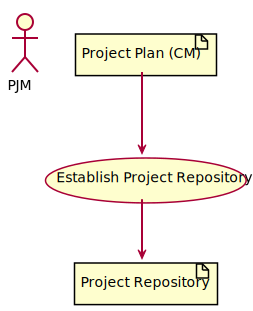

- [PM.2.6: Repository Management](iso29110-5-6-2-PM.md#pm26-repository-management)

  

- [PM.4.2: Update Repository](iso29110-5-6-2-PM.md#pm42-update-repository)

  

- [PM.2.7: Recover Repository](iso29110-5-6-2-PM.md#pm27-recovery-repository)

  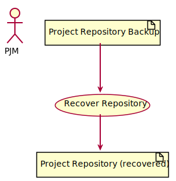

### Stateless meta elements

- Implementation Environment: defined in Project Plan
- Disposed System: defined in Project Plan
- Project Repository Backup: defined in Project Plan
- System Elements: defined in Data Model
