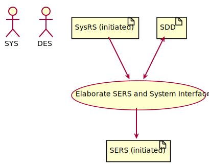
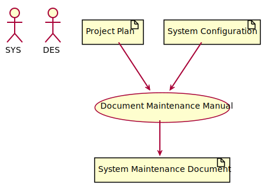

# ISO 29910-5-6-2 SR Activities

## SR.1: Initiation

* Updates:
   * [Project Plan](iso29110-5-6-2-ProcessProducts.md#project-plan)
* Outputs:
   * [Progress Status Record](iso29110-5-6-2-ProcessProducts.md#progress-status-record)
   * [SEMP](iso29110-5-6-2-ProcessProducts.md#systems-engineering-management-plan-semp)
   * [Data Model](iso29110-5-6-2-ProcessProducts.md#data-model)
   * Implementation Environment

### SR.1.1: Revise Project Plan

### SR.1.2: Generate SEMP

### SR.1.3: Generate Data Model

### SR.1.4: Update Implementation Environment

## SR.2: Requirements Engineering

### SR.2.1: Elicit Requirements

### SR.2.2: Verify StRS

### SR.2.3: Validate StRS

### SR.2.4: Elaborate SysRS and Interfaces

### SR.2.5: Elaborate SERS and System Interfaces

### SR.2.6: Verify SysRS and SERS

### SR.2.7: Validate SysRS

### SR.2.8: Update Traceability

### SR.2.9: Update IVV

## SR.3: Architecture

### SR.3.1: Functional Design

### SR.3.2: Functional trade-offs

### SR.3.3: Physical Design

### SR.3.4: Physical trade-offs

### SR.3.5: Verify System Design

### SR.3.6: Update IVV

### SR.3.7: Create System Manual

### SR.3.8: Verify System Manual

## SR.4: Construction

### SR.4.1: Construct Software

### SR.4.2: Construct Hardware

### SR.4.3: Verify System

### SR.4.4: Correct Defects

## SR.5: IVV

### SR.5.1: Verify IVV plan and procedures

### SR.5.2: Integrate System

### SR.5.3: Verify System

### SR.5.4: Validate System

### SR.5.5: Correct Defects

### SR.5.6: Document Operation Guide

### SR.5.7: Verify Operation Guide

## SR.6: Delivery

### SR.6.1: Review Product

### SR.6.2: Document Maintenance Manual

### SR.6.3: Document Training Spec

### SR.6.4: V&V Maintenance and Training

### SR.6.5: Perform Delivery

### SR.6.6: Transition to Manufacturing and support

